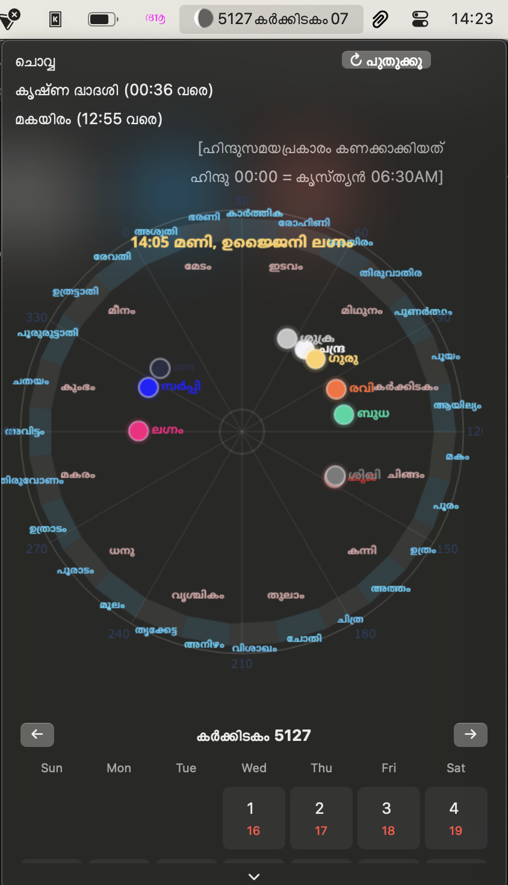
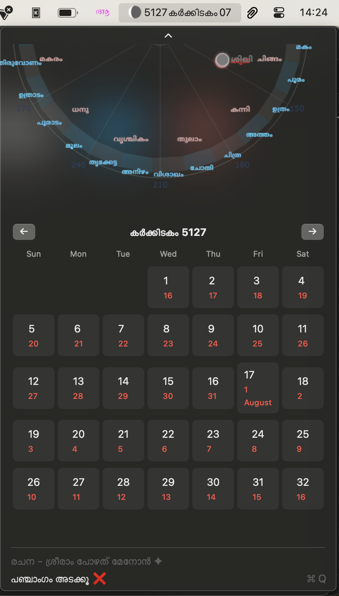

# Malayalam Astrological Calendar & Panchangam

**Accurate Malayalam calendar with astrological calculations following traditional Bharatiya timekeeping (06:30 AM = 00:00)**

## 🌟 Features

### Panchangam Display
- കൃഷ്ണവർഷ സൗരമാസ തിയ്യതി (e.g., `5127 കർക്കിടകം 07`)
- Today's complete details:
  - വാരം (Weekday)
  - തിഥി (Moon Phase) with end time
  - നക്ഷത്ര (Star) with end time
- Astrological Sky Map (explained below)
- Month view with Malayalam/Gregorian dates

### Astrological Sky Map
- Real-time celestial chart using Swiss Ephemeris (swisseph)
- Current ലഗ്ന (Ascendant) position
- Planetary positions in Rashis including രാഹു & കേതു
- Traditional Bharatiya time system (Christian Time - 6h30m)
- ((If you want to permanently start using Hindu time, use "Cape Verde (Praia)" as system timezone))

## ⏳ Time System Explained
We follow the **traditional Bharatiya astrological time** where:
- `00:00` = Sunrise (06:30 AM local time)
- `12:00` = Sunset (~06:30 PM)
- Night begins at next `12:01`

*Example:* App shows `13:30` → Actual time is 8:00 PM

## 📥 Installation

### For Regular Users:
1. Download the latest `.app` file from the folder that says [Move the file within to applications folder]
2. Drag to your `/Applications` folder
3. Right-click → Open (to bypass Gatekeeper on first launch)

### For Developers:
Use git clone
point the python to your venv (top line of python file). Existing line is my system specific. Python file is located as /Panchangam/scripts/solar_calendar.48m.py
use xcode to archive and create the same file.
